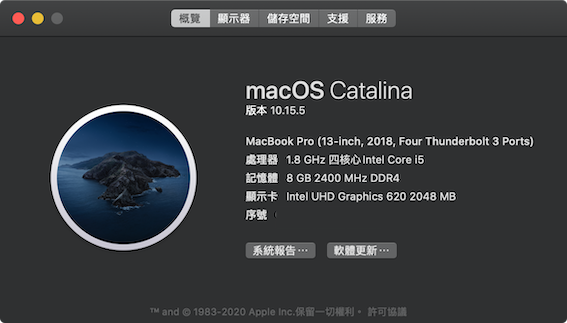
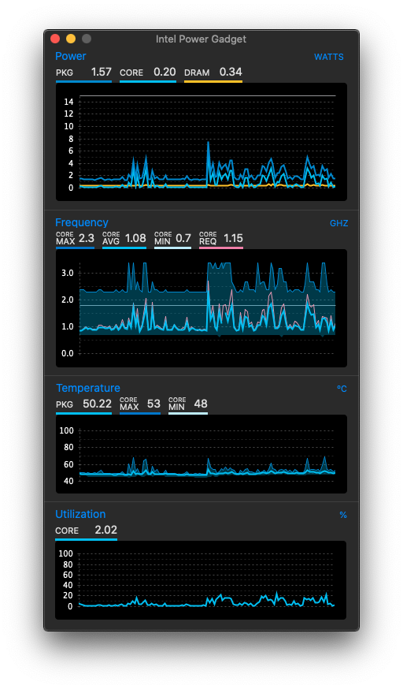
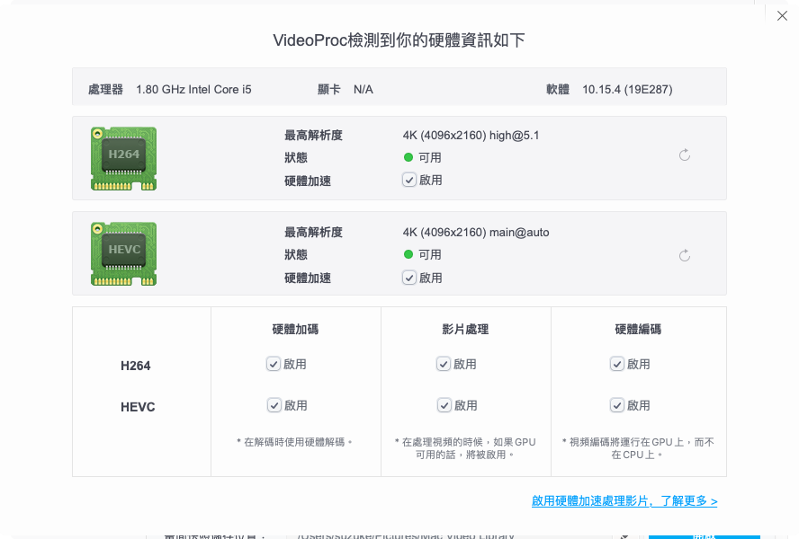

# 聲明
### 任何人都可免費使用，但嚴禁以此牟利收費。
### 尤其是蘋果地帶論壇，不可使用，[詳細見此](garbage.md)。
# LG-Gram-13z980-OpenCore

-
### 前言
基本上就是利用空閒時間進行，主要目的是學習 Hackintosh 的原理跟相關的知識。
有任何的問題或建議都可以發 Issue 或者 pull request。
### 詳細資訊
+ 系統版本 : macOS Catalina 10.15.4
+ OpenCore版本 : 0.5.8
+ CPU型號 : Intel i5-8250U
+ GPU型號 : UHD Graphics 620
+ 記憶體 : OnBoard 4G + 4G DDR4 2400MHz
+ SSD硬碟 : ADATA SX8200PNP NVME SSD 256G
+ 內建音效卡 : Conexant CX8200
+ 無線網卡 : Intel AC8265 (BCM94360CS2)

### 目前狀況
	這部分大概列出一些大家可能比較關心的項目，沒有特別提到的部分應該就是可以正常使用。
+ FN 快捷鍵
	1. 亮度調節 FN + F2, FN + F3 正常 (第一次不管F2, F3都是變亮，後續正常，待修)
	2. 睡眠開關 FN + F4 正常，~~使用 PNP0C0D 睡眠取代 PNP0C0E 睡眠，快速喚醒正常。~~
	3. 觸控板開關 FN + F5 正常，指示燈也正常。
	4. 鍵盤燈開關 FN + F8 正常
	5. 音量控制 FN + F10, FN + F11, FN + F12 正常
	6. FN + F1, FN + F6, FN + F7, FN + F9 目前尚未綁定功能，FN + F6 預計綁定為無線網卡開關，FN + F9 預計綁定夜覽模式，不過都還沒有找到合適的方式。
	7. FN + PrtSc 目前功能是跟 FN + F2 (調降亮度)一樣，待修復。
+ 觸控板正常， 支援多指手勢，也沒有常見的單指觸控失效問題。
+ 讀卡機失效，嘗試過 [Sinetek-rtsx](https://github.com/sinetek/Sinetek-rtsx)，原本10.15.3 下似乎可用，10.15.4 下插入 SD 卡後會直接導致自動重啟 (Kernel Panic)，所以目前直接移除Sinetek-rtsx，待收集資訊，再評估有無修復的可能。
+ 觸控螢幕失效，目前嘗試屏蔽原有 ACPI 中的 TPL裝置，定製一個新的TPX裝置使用，待修復。
+ ~~內建藍芽 10.15.4下顯示是可用的，但測試後評估為失效，原本使用 [IntelBluetoothFirmware](https://github.com/zxystd/IntelBluetoothFirmware) ，雖然可用，但是測試發現偶爾會導致開機緩慢或卡死，有穩定性的疑慮故暫時先移除，待詳細測試。~~
+ 內建無線網卡失效，目前在各方都有一些對於 Intel Wifi 網卡的嘗試 ( [itlwm](https://github.com/zxystd/itlwm), [AppleIntelWifi](https://github.com/AppleIntelWifi/adapter) )，不過都還達不到可以正常使用的階段，目前建議先以第二個M2插槽轉接 BCM94360CS2 免驅卡使用。
+ 睡眠 / 喚醒，測試正常，睡眠狀況下觀察耗電量也是極低。
+ Hdmi 與耳機輸出都正常，也支援多螢幕顯示。
+ USB & Type-C 正常。

### 參考

